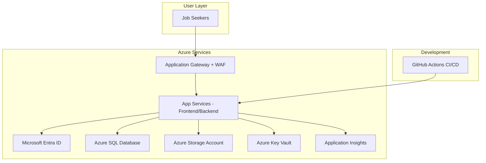

# CareerLog

A comprehensive Job Search Journal built with Spring Boot and React, showcasing modern Azure cloud services and production-ready patterns.


## Overview

CareerLog helps job seekers track applications, interviews, and career progress in one secure, cloud-deployed platform. It demonstrates a full-stack architecture using Microsoft Azure services.

### Key Features

- **Azure AD Authentication** – Secure login with Microsoft Entra ID
- **Analytics Dashboard** – Status breakdowns, weekly trends, and activity summaries
- **Application Management** – Full CRUD with status tracking
- **Activity Timeline** – Log interviews, follow-ups, and recruiting events
- **File Attachments** – Upload resumes, cover letters, and portfolios to Azure Blob Storage
- **Enterprise Security** – Azure Key Vault for secrets, Application Gateway with WAF
- **Monitoring** – Application Insights for performance tracking and error monitoring

## Architecture



## Technology Stack

### Backend (Spring Boot 3.x)
- Java 17+
- Spring Web, Spring Data JPA
- Spring Security + OAuth2 (Azure AD)
- Azure SDK (Storage, Key Vault)
- Application Insights
- Maven

### Frontend (React + Vite)
- React 18 with TypeScript
- MSAL React (Azure AD)
- React Router
- Axios with JWT handling
- Recharts
- Tailwind CSS
- Vite

### Azure Services
- Azure App Service (frontend/backend)
- Azure SQL Database
- Azure Blob Storage
- Azure Key Vault
- Microsoft Entra ID
- Application Gateway (with WAF)
- Application Insights
- GitHub Actions (CI/CD)

## Getting Started

### Prerequisites
- Java 17+
- Node.js 18+
- Maven 3.8+
- PostgreSQL (for local development)
- Azure subscription (for deployment)

### Local Development

1) **Clone**
```bash
git clone https://github.com/your-username/careerlog.git
cd careerlog
```

2) **Backend**
```bash
cd backend
cp .env.example .env   # fill in DB and Azure values
mvn clean install
mvn spring-boot:run
```

3) **Frontend**
```bash
cd frontend
cp .env.example .env   # fill in Azure AD app registration + API base URL
npm install
npm run dev
```

4) **Database (PostgreSQL)**
```sql
CREATE DATABASE careerlog;
CREATE USER careerlog_user WITH PASSWORD 'careerlog_pass';
GRANT ALL PRIVILEGES ON DATABASE careerlog TO careerlog_user;
```

5) **Azure AD App Registration**
- Register two apps: **Backend API** and **Frontend SPA**
- Backend identifier URI: `api://careerlog-backend` (or your choice)
- Frontend redirect URI: `http://localhost:5173`
- Grant `User.Read` (Graph) and `access_as_user` (your API)

## Azure Deployment

### Automated (recommended)
1. Fork this repository.
2. Configure GitHub secrets:
   - `AZURE_WEBAPP_PUBLISH_PROFILE`
   - `API_BASE_URL`
   - `AZURE_CLIENT_ID`
   - `AZURE_AUTHORITY`
   - `AZURE_REDIRECT_URI`
3. Push to `main`; GitHub Actions will deploy.

### Manual
1. Provision Azure resources (see `infra/azure-setup-notes.md`).
2. Backend:
```bash
cd backend
mvn clean package -DskipTests
az webapp deploy --resource-group rg-careerlog-dev --name careerlog-backend-app --target-path / --src target/*.jar
```
3. Frontend:
```bash
cd frontend
npm run build
az webapp deploy --resource-group rg-careerlog-dev --name careerlog-frontend-app --src dist/
```

## Project Structure

```
careerlog/
├─ backend/                 # Spring Boot REST API
│  └─ src/main/java/com/careerlog/
│     ├─ controller/        # REST endpoints
│     ├─ service/           # Business logic
│     ├─ repository/        # JPA repositories
│     ├─ model/             # JPA entities
│     ├─ config/            # Security and Azure config
│     └─ exception/         # Exception handling
│  └─ src/main/resources/   # application.yml and assets
├─ frontend/                # React SPA
│  └─ src/
│     ├─ components/        # Reusable UI
│     ├─ pages/             # Page components
│     ├─ auth/              # Azure AD auth
│     ├─ api/               # API services and types
│     └─ hooks/             # Custom React hooks
├─ infra/                   # Infrastructure as code and diagrams
└─ docs/                    # Additional documentation
```

## Configuration

### Backend (.env.example)
```
DB_HOST=localhost
DB_PORT=5432
DB_NAME=careerlog
DB_USERNAME=careerlog_user
DB_PASSWORD=careerlog_pass

# Azure (production)
AZURE_DATABASE_URL=jdbc:sqlserver://...
AZURE_STORAGE_ACCOUNT_NAME=...
AZURE_KEYVAULT_URI=https://...

# Azure AD
AZURE_AD_CLIENT_ID=...
AZURE_AD_ISSUER_URI=...
```

### Frontend (.env.example)
```
# Azure AD
VITE_AZURE_CLIENT_ID=your-frontend-client-id
VITE_AZURE_AUTHORITY=https://login.microsoftonline.com/your-tenant-id
VITE_AZURE_REDIRECT_URI=http://localhost:5173

# API
VITE_API_BASE_URL=http://localhost:8080/api
```

## Testing

### Backend
```bash
cd backend
mvn test
```

### Frontend
```bash
cd frontend
npm run build   # ensures type-safety and bundle
```

### End-to-End
```bash
# Start backend and frontend locally, then run your e2e suite
```

## Monitoring and Analytics
- Application Insights for performance, usage analytics, error tracking, and live metrics.
- Custom metrics: application CRUD events, status changes, uploads/downloads, auth patterns, endpoint performance.

## Security Features
- OAuth 2.0 + JWT
- CORS controls
- CSRF protection
- Rate limiting
- Input validation
- Secrets in Key Vault
- WAF protection
- Secure headers (HSTS, CSP, etc.)

## Cost Optimization
- Use App Service B1/Basic for dev
- Basic tier Azure SQL for small workloads
- LRS storage with lifecycle policies
- Reserved instances for prod
- CDN for frontend assets when scaling

## Contributing
1. Fork the repo.
2. Create a feature branch: `git checkout -b feature/amazing-feature`
3. Commit: `git commit -m "Add amazing feature"`
4. Push: `git push origin feature/amazing-feature`
5. Open a Pull Request.

Guidelines: Spring Boot best practices with tests; React + TypeScript with hooks; migrations for DB changes; keep secrets out of code; update docs when behavior changes.

## API (quick reference)

Authentication: `Authorization: Bearer <jwt>`

### Applications
- `GET /api/applications`
- `POST /api/applications`
- `GET /api/applications/{id}`
- `PUT /api/applications/{id}`
- `DELETE /api/applications/{id}`

### Activities
- `GET /api/activities/application/{id}`
- `POST /api/activities`
- `GET /api/activities/user`

### Dashboard
- `GET /api/dashboard/overview`
- `GET /api/dashboard/applications-per-week`

For full docs, see Swagger at `http://localhost:8080/swagger-ui.html`.

## Troubleshooting

1. **Azure AD login**: verify redirect URIs, client/tenant IDs, API permissions.
2. **Database connection**: check firewall rules, connection strings, and credentials.
3. **CORS**: align frontend `VITE_API_BASE_URL` with backend allowed origins.
4. **Deployment**: ensure publish profiles and environment variables are set; check App Service logs.

Support: open GitHub issues, consult `docs/`, and monitor Azure Portal for resource health.

## License

MIT License - see [LICENSE](LICENSE).

---

Built for job seekers everywhere. Happy tracking!
