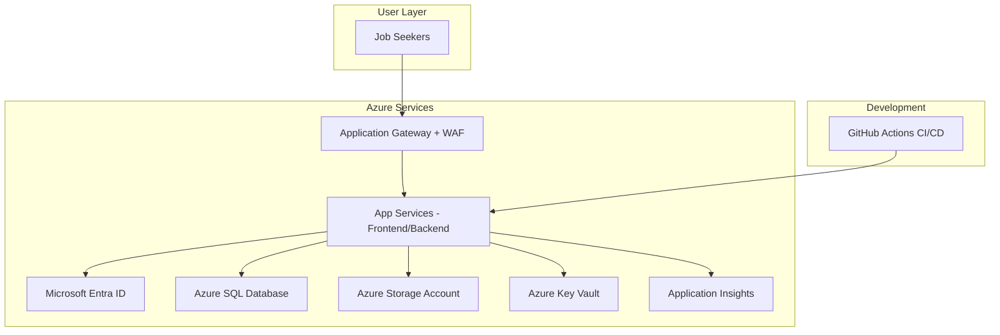

# CareerLog

A comprehensive Job Search Journal application built with Spring Boot + React, showcasing modern Azure cloud services and best practices.


## 🌟 Overview

CareerLog helps job seekers track their job applications, interviews, and career progress in one secure, cloud-deployed platform. It demonstrates production-ready architecture using Microsoft Azure services.

### Key Features

- **🔐 Azure AD Authentication** - Secure login with Microsoft Entra ID
- **📊 Analytics Dashboard** - Track application status, weekly trends, and activity breakdowns
- **💼 Application Management** - Complete CRUD for job applications with status tracking
- **📝 Activity Timeline** - Log interviews, follow-ups, and recruitment activities
- **📎 File Attachments** - Upload resumes, cover letters, and portfolio files to Azure Blob Storage
- **🔒 Enterprise Security** - Azure Key Vault for secrets, Application Gateway with WAF
- **📈 Monitoring** - Application Insights for performance tracking and error monitoring

## 🏗️ Architecture



## 🛠️ Technology Stack

### Backend (Spring Boot 3.x)
- **Java 17+** - Modern Java development
- **Spring Web** - RESTful APIs
- **Spring Data JPA** - Database ORM
- **Spring Security + OAuth2** - Azure AD integration
- **Azure SDK** - Storage, Key Vault integration
- **Application Insights** - Telemetry and monitoring
- **Maven** - Build and dependency management

### Frontend (React + Vite)
- **React 18** with TypeScript
- **MSAL React** - Azure AD authentication
- **React Router** - Client-side routing
- **Axios** - HTTP client with JWT handling
- **Recharts** - Data visualization
- **Tailwind CSS** - Utility-first styling
- **Vite** - Fast build tooling

### Azure Services
- **Azure App Service** - Linux hosting for both apps
- **Azure SQL Database** - Relational data storage
- **Azure Blob Storage** - File storage for attachments
- **Azure Key Vault** - Secrets management
- **Microsoft Entra ID** - Identity and access management
- **Application Gateway** - Load balancing and WAF
- **Application Insights** - APM and monitoring
- **GitHub Actions** - CI/CD deployment pipeline

## 🚀 Getting Started

### Prerequisites

- **Java 17+**
- **Node.js 18+**
- **Maven 3.8+**
- **PostgreSQL** (for local development)
- **Azure Subscription** (for deployment)

### Local Development Setup

1. **Clone the repository**
   ```bash
   git clone https://github.com/your-username/careerlog.git
   cd careerlog
   ```

2. **Backend Setup**
   ```bash
   cd backend
   cp .env.example .env
   # Edit .env with your local database credentials
   mvn clean install
   mvn spring-boot:run
   ```

3. **Frontend Setup**
   ```bash
   cd frontend
   cp .env.example .env
   # Edit .env with your Azure AD app registration details
   npm install
   npm run dev
   ```

4. **Database Setup (PostgreSQL)**
   ```sql
   CREATE DATABASE careerlog;
   CREATE USER careerlog_user WITH PASSWORD 'careerlog_pass';
   GRANT ALL PRIVILEGES ON DATABASE careerlog TO careerlog_user;
   ```

5. **Azure AD App Registration**
   - Register two applications in Azure AD
   - **Backend API**: Configure as Web API with `api://careerlog-backend` identifier URI
   - **Frontend SPA**: Configure as Single-page app with redirect URL `http://localhost:5173`
   - Set proper API permissions: `User.Read` (Microsoft Graph) and `access_as_user` (your API)

## ☁️ Azure Deployment

### Automated Deployment (Recommended)

1. **Fork this repository** to your GitHub account
2. **Configure GitHub Secrets**:
   - `AZURE_WEBAPP_PUBLISH_PROFILE` - Azure App Service publish profiles
   - `API_BASE_URL` - Production API endpoint
   - `AZURE_CLIENT_ID` - Frontend Azure AD client ID
   - `AZURE_AUTHORITY` - Azure AD authority URL
   - `AZURE_REDIRECT_URI` - Production frontend URL

3. **Push to main branch** - GitHub Actions will automatically deploy

### Manual Deployment

1. **Provision Azure Resources** (see `infra/azure-setup-notes.md`)
2. **Build and Deploy Backend**:
   ```bash
   cd backend
   mvn clean package -DskipTests
   az webapp deploy --resource-group rg-careerlog-dev --name careerlog-backend-app --target-path / --src target/*.jar
   ```

3. **Build and Deploy Frontend**:
   ```bash
   cd frontend
   npm run build
   az webapp deploy --resource-group rg-careerlog-dev --name careerlog-frontend-app --src dist/
   ```

## 📁 Project Structure

```
careerlog/
├── backend/                    # Spring Boot REST API
│   ├── src/main/java/com/careerlog/
│   │   ├── controller/         # REST endpoints
│   │   ├── service/           # Business logic
│   │   ├── repository/        # JPA repositories
│   │   ├── model/            # JPA entities
│   │   ├── config/           # Security and Azure config
│   │   └── exception/        # Exception handling
│   └── src/main/resources/
│       └── application.yml    # Configuration profiles
├── frontend/                  # React SPA
│   ├── src/
│   │   ├── components/        # Reusable UI components
│   │   ├── pages/           # Page components
│   │   ├── auth/            # Azure AD authentication
│   │   ├── api/             # API services and types
│   │   └── hooks/           # Custom React hooks
│   └── dist/                # Build output
├── infra/                    # Infrastructure as code
│   ├── architecture-diagram.mmd
│   └── azure-setup-notes.md
├── docs/                     # Additional documentation
└── .github/workflows/         # CI/CD pipelines
```

## 🔧 Configuration

### Backend Profiles

- **local**: PostgreSQL database, local file system
- **azure**: Azure SQL, Managed Identity, Key Vault integration

### Environment Variables

#### Backend (.env.example)
```bash
# Database
DB_HOST=localhost
DB_PORT=5432
DB_NAME=careerlog
DB_USERNAME=careerlog_user
DB_PASSWORD=careerlog_pass

# Azure (production)
AZURE_DATABASE_URL=jdbc:sqlserver://...
AZURE_STORAGE_ACCOUNT_NAME=...
AZURE_KEYVAULT_URI=https://...

# Azure AD
AZURE_AD_CLIENT_ID=...
AZURE_AD_ISSUER_URI=...
```

#### Frontend (.env.example)
```bash
# Azure AD
VITE_AZURE_CLIENT_ID=your-frontend-client-id
VITE_AZURE_AUTHORITY=https://login.microsoftonline.com/your-tenant-id
VITE_AZURE_REDIRECT_URI=http://localhost:5173

# API
VITE_API_BASE_URL=http://localhost:8080/api
```

## 🧪 Testing

### Backend Tests
```bash
cd backend
mvn test
```

### Frontend Tests
```bash
cd frontend
npm run test
```

### End-to-End Tests
```bash
# Start both services
npm run test:e2e
```

## 📊 Monitoring and Analytics

### Application Insights
- **Performance Monitoring**: Response times, error rates, dependency tracking
- **Usage Analytics**: Feature usage, user sessions, custom events
- **Error Tracking**: Exception telemetry, crash reports
- **Live Metrics**: Real-time performance monitoring

### Custom Metrics Tracked
- Application creation/update/deletion events
- Status changes and workflow progression
- File upload and download operations
- User authentication patterns
- API endpoint performance

## 🔒 Security Features

- **OAuth 2.0 + JWT** - Standard token-based authentication
- **CORS Protection** - Configurable cross-origin policies
- **CSRF Protection** - Form submission security
- **Rate Limiting** - API abuse prevention
- **Input Validation** - Data integrity and XSS prevention
- **Secret Management** - Azure Key Vault integration
- **WAF Protection** - OWASP Top 10 protection at edge
- **Secure Headers** - HSTS, CSP, and other security headers

## 💰 Cost Optimization

### Azure Free Tier Usage
- **App Service**: B1 tier (~$13/month) - Basic hosting
- **Azure SQL**: Basic tier (~$5/month) - 2GB storage
- **Storage Account**: LRS (~$0.02/GB/month) - Attachment storage
- **Key Vault**: Free tier - 25,000 transactions/month
- **Application Insights**: Free tier - 5GB data/month

### Cost-Saving Strategies
1. **Auto-scaling**: Scale based on demand
2. **Reserved Instances**: 1-3 year commitments for production
3. **Storage Tiers**: Lifecycle policies for old attachments
4. **Database Optimization**: Query optimization and indexing
5. **CDN Integration**: Frontend asset delivery

## 🤝 Contributing

1. **Fork the repository**
2. **Create a feature branch**: `git checkout -b feature/amazing-feature`
3. **Commit changes**: `git commit -m 'Add amazing feature'`
4. **Push to branch**: `git push origin feature/amazing-feature`
5. **Open a Pull Request**

### Development Guidelines

- **Backend**: Follow Spring Boot best practices, write unit tests
- **Frontend**: Use TypeScript, follow React hooks patterns
- **Database**: Use migrations for schema changes
- **Security**: Never commit secrets, use environment variables
- **Documentation**: Update README and inline documentation

## 📝 API Documentation

### Authentication
All API endpoints require a valid Azure AD JWT token in the `Authorization` header:
```
Authorization: Bearer <your-jwt-token>
```

### Key Endpoints

#### Applications
- `GET /api/applications` - List user applications (paginated)
- `POST /api/applications` - Create new application
- `GET /api/applications/{id}` - Get application details
- `PUT /api/applications/{id}` - Update application
- `DELETE /api/applications/{id}` - Delete application

#### Activities
- `GET /api/activities/application/{id}` - Get application activities
- `POST /api/activities` - Log new activity
- `GET /api/activities/user` - Get user activities

#### Dashboard
- `GET /api/dashboard/overview` - Dashboard analytics
- `GET /api/dashboard/applications-per-week` - Weekly trends

For complete API documentation, see the Swagger UI at `http://localhost:8080/swagger-ui.html`

## 🐛 Troubleshooting

### Common Issues

1. **Azure AD Login Issues**
   - Verify app registration redirect URIs
   - Check client ID and tenant ID
   - Ensure proper API permissions

2. **Database Connection Issues**
   - Verify firewall rules allow Azure IP addresses
   - Check connection string format
   - Validate user permissions

3. **CORS Issues**
   - Configure allowed origins in Spring Security
   - Set proper frontend API base URL
   - Check preflight OPTIONS handling

4. **Deployment Issues**
   - Verify publish profiles in GitHub Secrets
   - Check App Service startup logs
   - Validate environment variables

### Support

- **GitHub Issues**: Report bugs and feature requests
- **Documentation**: Check `docs/` for detailed guides
- **Azure Portal**: Monitor resource health and metrics

## 📄 License

This project is licensed under the MIT License - see the [LICENSE](LICENSE) file for details.

## 🙏 Acknowledgments

- **Microsoft Azure** - Cloud infrastructure and services
- **Spring Framework** - Backend framework
- **React Team** - Frontend framework
- **Tailwind CSS** - Utility-first CSS framework
- **Recharts** - Data visualization library

---

**Built with ❤️ for job seekers everywhere** 🚀